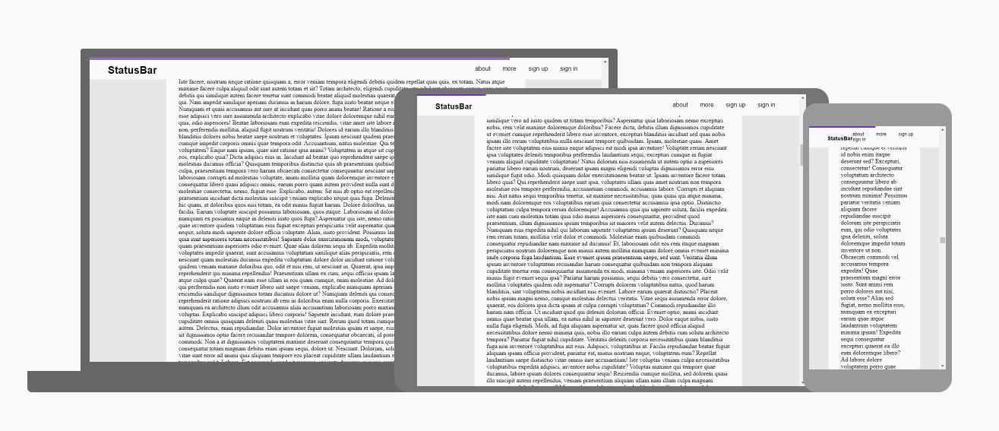

<h1 align="center">
  <bold>Status Bar Effect</bold>
</h1>

<h3 align="center"> 📄 🚀 </h3>

<p align="center">
  

  

  

  

  
</p>

<br/>
<hr/>

<p>Status bar para indicar a posição da página, útil para leitura</p>

<hr/>

<br/>

<p align="center">
  
</p>

<br/>
<br/>
<hr/>

<h3> ☑️ Como utilizar </h3>

Instale o [Git](https://git-scm.com/downloads) e o [Visual Studio Code](https://code.visualstudio.com/)

```shell
# Clone este repositório
git clone https://github.com/rwietter/progress-status-bar-js.git

# Entre no diretório
cd progress-status-bar-js

# Abrir o index.html no browser
cd src
```

<hr/>

### 🌐 Como contribuir
- Faça um fork deste repositório;
- Crie uma branch com a sua feature: `git checkout -b my-feature`
- Faça um commit das suas mudanças: `git commit -m 'feat: My new feature'`
- De push na sua branch: `git push origin my-feature`

<hr/>

### 📝 Licença

Esse projeto está sob a licença MIT. Veja o arquivo [LICENSE](LICENSE) para mais detalhes.

<hr/>

<p align="center">
  <bold>Feito por @rwietter</bold>
</p>
